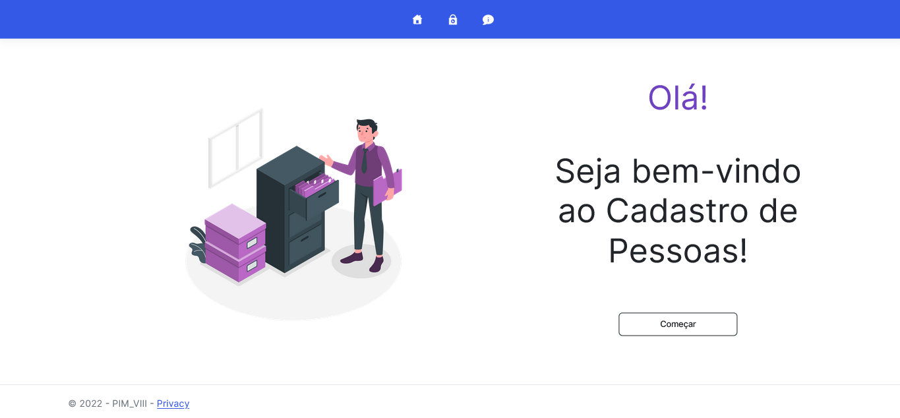
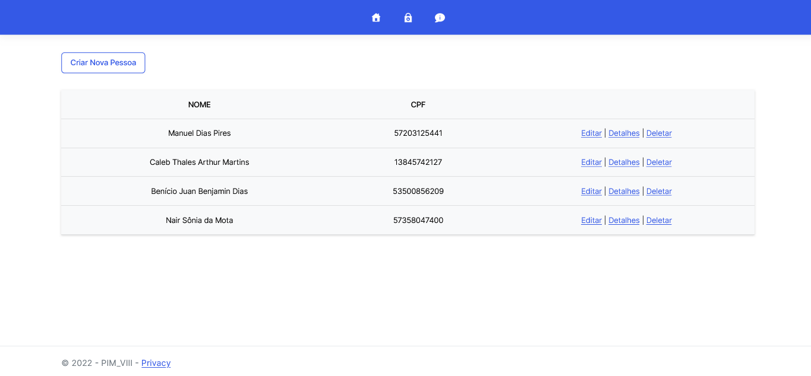
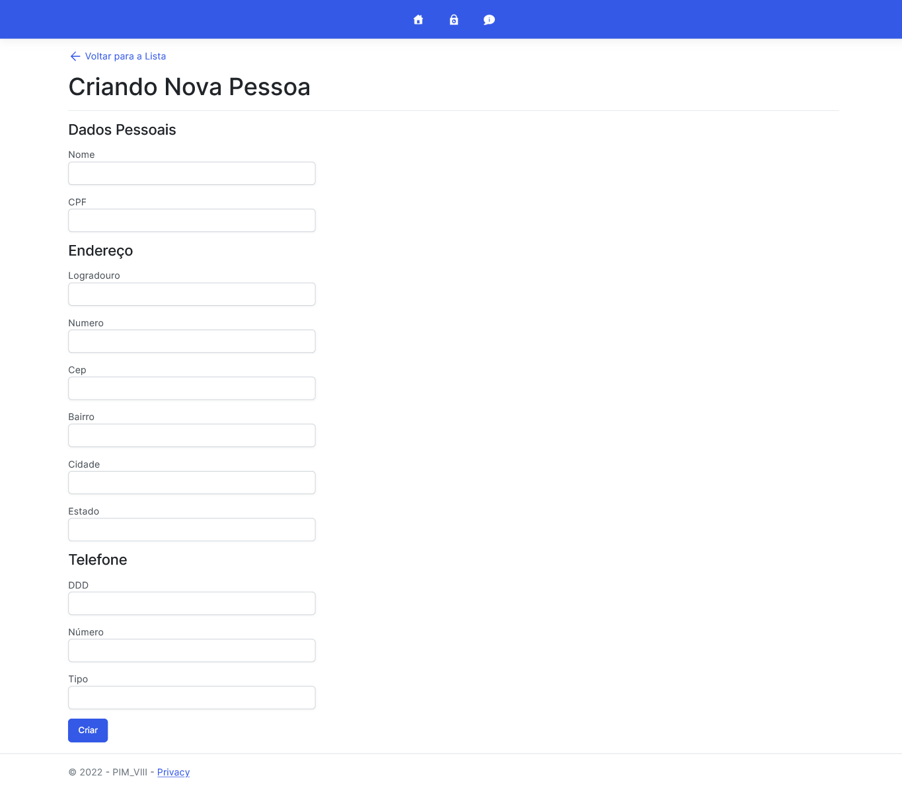
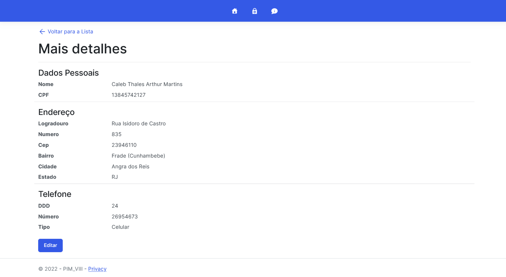
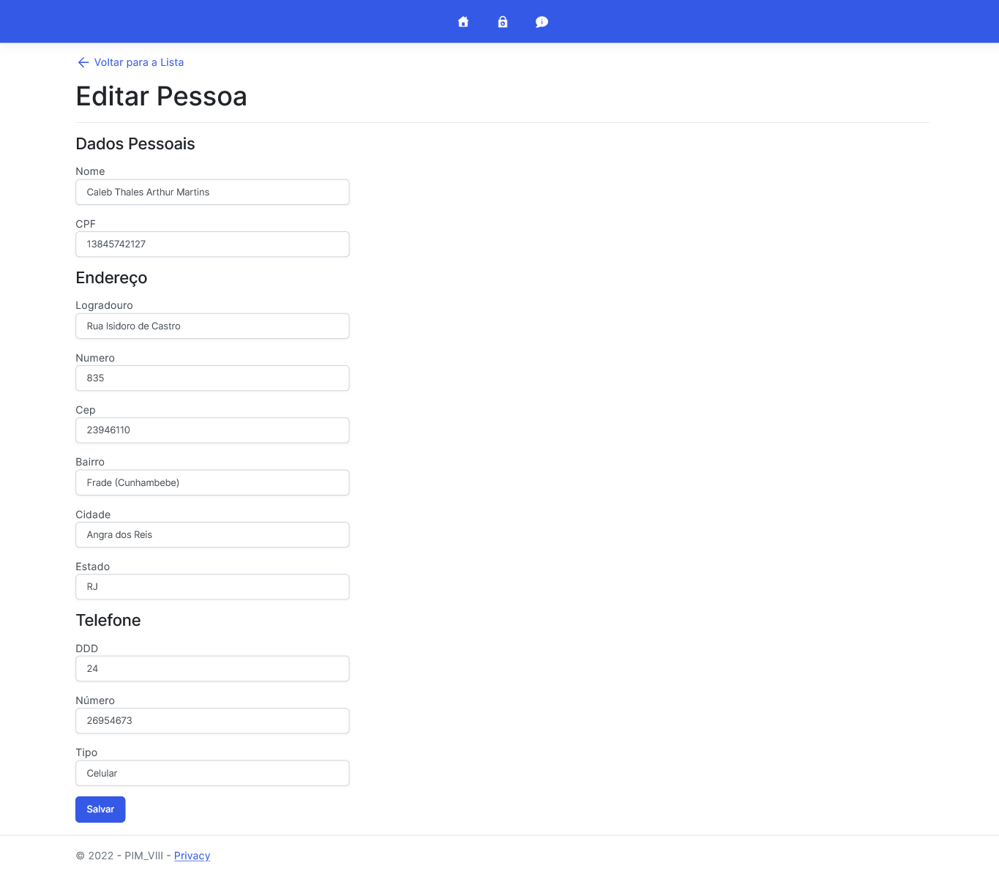
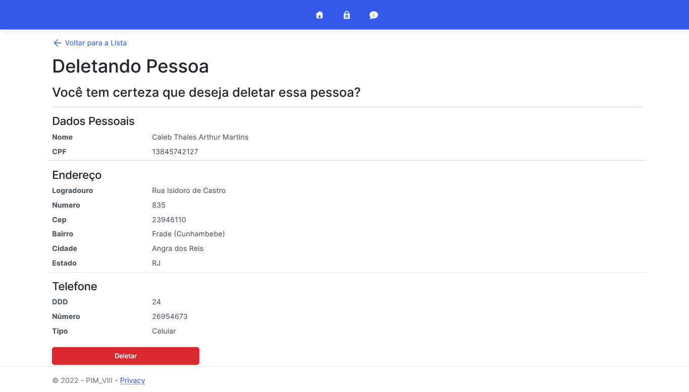

# Cadastro de Pessoas

"Cadastro de Pessoas" foi desenvolvido para o Projeto Integrado Multidisciplinar (PIM) do curso Análise e Desenvolvimento de Sistemas na Universidade Paulista (UNIP), uma plataforma baseada em nuvem hospedada no Azure, que permite a realização de cadastros de pessoas de forma simples e eficiente.

## Sumário

- [Visão Geral](#visão-geral)
  - [Recursos Principais](#recursos-principais)
    - [Criação, Visualização, Edição e Exclusão de Cadastros](#criação-visualização-edição-e-exclusão-de-cadastros)
- [Links Úteis 🔗](#links-úteis-)
- [Meu Processo](#meu-processo)
  - [Construído com](#construído-com)
- [Screenshots 💻](#screenshots-)
  - [Home Page](#home-page)
  - [Lista de pessoas cadastradas](#lista-de-pessoas-cadastradas)
  - [Formulário de cadastro](#formulário-de-cadastro)
  - [Visualização dos dados da pessoa cadastrada](#visualização-dos-dados-da-pessoa-cadastrada)
  - [Edição dos dados da pessoa cadastrada](#edição-dos-dados-da-pessoa-cadastrada)
  - [Exclusão dos dados da pessoa cadastrada](#exclusão-dos-dados-da-pessoa-cadastrada)
- [Disclaimer ⚠️](#disclaimer-️)

## Visão Geral

A aplicação "Cadastro de Pessoas" é uma solução completa para gerenciar informações de indivíduos. Com uma interface intuitiva e funcionalidades abrangentes.

## Recursos Principais

O principal recurso da aplicação é a capacidade de cadastrar pessoas de forma rápida e precisa. Os usuários podem preencher um formulário com informações pessoais, como nome, CPF, endereço e telefone. Essas informações são armazenadas no banco de dados do site.

### Criação, Visualização, Edição e Exclusão de Cadastros

A aplicação apresenta todas as funcionalidades esperadas de um sistema CRUD (Create, Read, Update, Delete). Além do cadastro inicial, o site também permite a visualização, a edição e a exclusão de informações de pessoas já cadastradas. Os usuários podem atualizar os dados sempre que necessário, garantindo que as informações estejam sempre atualizadas e corretas. Os usuários também podem excluir cadastros, se necessário.

## Links Úteis 🔗

- Live Site URL: [Cadastro de Pessoas](https://cadastro-de-pessoas.azurewebsites.net).

## Meu Processo

### Construído com

- [Visual Studio](https://visualstudio.microsoft.com/pt-br/) - IDE de desenvolvimento
- [ASP.NET Core MVC](https://dotnet.microsoft.com/apps/aspnet) - Framework de desenvolvimento web
- [C#](https://docs.microsoft.com/pt-br/dotnet/csharp/) - Linguagem de programação
- [Azure](https://azure.microsoft.com/pt-br/) - Serviço de nuvem
- [SQLite](https://www.sqlite.org/index.html) - Banco de dados
- [Bootstrap](https://getbootstrap.com/) - Framework de CSS

## Screenshots 💻

### Home Page

### Lista de pessoas cadastradas

### Formulário de cadastro

### Visualização dos dados da pessoa cadastrada

### Edição dos dados da pessoa cadastrada

### Exclusão dos dados da pessoa cadastrada

## Disclaimer ⚠️

Este projeto foi desenvolvido para fins educacionais. O objetivo é demonstrar o conhecimento adquirido durante o curso de Análise e Desenvolvimento de Sistemas na Universidade Paulista (UNIP). O projeto não deve ser utilizado para fins comerciais.

Todos os dados utilizados no projeto são fictícios.
